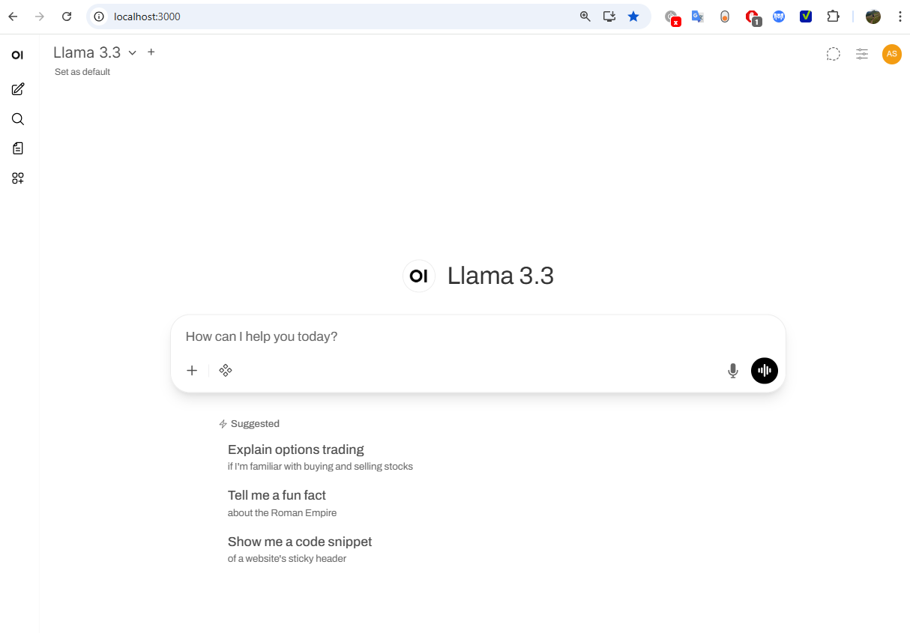

# Czech OpenWebUI 

This guide explains the configuration of OpenWebUI with our best found RAG setup. We use qwen3-embedding-4B embedder and there is an option for all generative models provided by e-INFRA (in our small user study the winning model was llama3.3:latest, you can choose it manually in the chat window).

 First, we use e-INFRA API to integrate the generative models. Then, we use a cluster (MetaCentrum) to serve the embedding model via vLLM. Finally, we run OpenWebUI with specifiying the endpoints for the embedding and generative models.

## When to Run What
If you just want a running instance of OpenWebUI with all generative models and you do not want to tryout experimenting with RAG much eaiser option is to just use the already working solution by e-INFRA: https://docs.cerit.io/en/docs/ai-as-a-service/chat-ai#accessing-open-webui 
On the other hand if you want to experiment with RAG and change settings you need to have admin priviledges so we provide a way to create your own instance:)

## System Efficiency
The master thesis mainly compared different embedders and did a small scale study on which generative model to pick, please do not expect the system to be without mistakes, it is the best settings we could find on our datasets:). 

## Prerequisites

- Docker installed on your machine https://www.docker.com/get-started/
- MetaCentrum account (for e-INFRA API access, note you can only get this if you are a member of another academic or research institution in the Czech Republic) https://docs.cerit.io/en/docs/ai-as-a-service/chat-ai#accessing-open-webui


## Quick Start

### 1. Clone the Repository

```bash
git clone <repository-url>
cd czech_openwebui
```

### 2. Create Environment File

Copy the example environment file:

```bash
cp example.env .env
```

### 3. Get Your e-INFRA API Key

1. Create a MetaCentrum account (if you don't have it) at https://docs.cerit.io/en/docs/ai-as-a-service/chat-ai#accessing-open-webui
2. Generate an API key following: https://docs.cerit.io/en/docs/ai-as-a-service/chat-ai#creating-an-api-key
3. Update `EINFRA_API_KEY` in your `.env` file

**Verify your API key works:**
```bash
export EINFRA_API_KEY="your-key-here"
curl -H "Authorization: Bearer $EINFRA_API_KEY" https://llm.ai.e-infra.cz/v1/models | jq .data[].id
```

## Embedding Model Setup


### 1. Set Up MetaCentrum GPU Node

ssh to MetaCentrum frontend node:
```bash 
 ssh sajdokova@tarkil.metacentrum.cz
```
**Note:** Replace `tarkil` with your frontend node choice (f.e., `tilia`,`zenith` choose at  [frontend_options_metacentrum_link](https://docs.metacentrum.cz/en/docs/computing/infrastructure/frontends))  and `sajdokova` with your MetaCentrum username.

Request an interactive GPU job (here we have it for 5 hours):
```bash
qsub -I \
  -l select=1:ncpus=8:mem=32gb:ngpus=1:scratch_local=20gb:gpu_mem=10gb \
  -l walltime=5:00:00
```

### 2. Install vLLM

```bash
module load mambaforge
mamba create -n vllm python=3.11
mamba activate vllm

# Set up pip cache in scratch directory
export PIP_CACHE_DIR=$SCRATCHDIR/pip-cache
mkdir -p $PIP_CACHE_DIR

pip install vllm

# Set up HuggingFace cache
export HF_HOME=/storage/brno2/home/$USER/huggingface
mkdir -p $HF_HOME

# Bug fix: vllm needs this set to 0
export CUDA_VISIBLE_DEVICES=0
```

### 3. Start vLLM Embedding Server

```bash
python -m vllm.entrypoints.openai.api_server \
  --model Qwen/Qwen3-Embedding-4B \
  --runner pooling \
  --dtype float16 \
  --disable-log-stats \
  --gpu-memory-utilization 0.85 \
  --host 0.0.0.0 \
  --port 8888 \
  > vllm.log 2>&1 &
```

Monitor the startup (takes ~3 minutes):
```bash
tail -f vllm.log
```

### 4. Create SSH Tunnel

From your local machine, create a tunnel to the GPU node (keep it running in a terminal until you are done):
```bash
ssh -L 8888:galdor19:8888 sajdokova@tarkil.metacentrum.cz
```

**Note:** Replace `galdor19` with your actual GPU node name and `sajdokova` with your MetaCentrum username.

### 5. Test the Embedding Server

From your local machine:
```bash
curl http://localhost:8888/v1/embeddings \
  -H "Content-Type: application/json" \
  -d '{
    "model": "Qwen/Qwen3-Embedding-4B",
    "input": ["hello from laptop"]
  }'
```

You should see an embedding vector (array of numbers).

## Start the Container

```bash
docker compose -f docker-compose.yml -p czech_openwebui up -d
```

**Note:** The first startup may take 10+ minutes. Be paitient, check your docker started, then proceed to
`http://localhost:3000`. You should see instance of OpenWebUI.




### AND DONE ✨
 You can add custom data via Knowledge. Then ask about it in chat with `#your_collection_name`.
The setting of RAG can be modified via the web as well (`Admin panel -> Setting -> Documents`).


Note if for some reason you just want to run plain OpenWebUI in docker you can use only_openwebUI_docker.txt file contents or refer to [OpenWebUI documentation](https://docs.openwebui.com/getting-started/quick-start/)

## Configuration Details

### Environment Variables

The `docker-compose.yml` uses the following environment variables from `.env`:

| Variable | Description | Example |
|----------|-------------|---------|
| `EINFRA_API_KEY` | Your e-INFRA API key | `sk-xxxxxxxxxxxxxxxx` |
| `EMBEDDING_BASE_URL` | URL to your vLLM embedding server | `http://host.docker.internal:8888/v1` |
| `EMBEDDING_MODEL` | Name of the embedding model | `Qwen/Qwen3-Embedding-4B` |
| `EMBEDDING_API_KEY` | API key for embedding server (can be dummy) | `dummy` |


## Troubleshooting

### Container won't start
- Check that `.env` file exists and contains all required variables
- Verify Docker is running: `docker ps`

### Can't connect to e-INFRA
- Verify your API key is correct
- Test the API key with the curl command above
- Check that you have a valid MetaCentrum account

### Embedding server not accessible
- Ensure SSH tunnel is active and connected
- Verify vLLM server is running on the GPU node
- Check that the port (8888) matches in both tunnel and docker-compose.yml
- Test with the curl command from your local machine

### Models not appearing
- Wait 10+ minutes on first startup
- Check container logs: `docker compose logs -f czech_openwebui`
- Verify environment variables are correctly set


## Additional Resources

- e-INFRA Documentation: https://docs.cerit.io/en/docs/ai-as-a-service/chat-ai
- OpenWebUI Documentation: https://docs.openwebui.com/
- MetaCentrum: https://www.metacentrum.cz/

